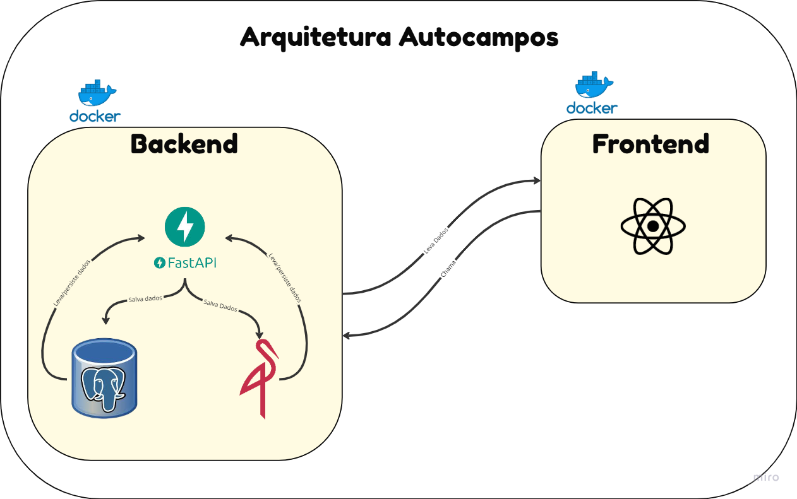

# Arquitetura do Projeto

O projeto **AutoCampos** adota uma arquitetura baseada em microsserviços, com foco em modularidade, escalabilidade e facilidade de manutenção.

## Backend

O backend é totalmente containerizado e composto por diversos serviços que se comunicam entre si. As principais tecnologias utilizadas incluem:

- **FastAPI** — Framework moderno e performático para construção de APIs RESTful em Python.
- **PostgreSQL** — Banco de dados relacional robusto e confiável.
- **MinIO** — Solução de armazenamento de objetos compatível com S3, utilizada para armazenar arquivos e dados não estruturados.
- **Docker** — Utilizado para conteinerizar os serviços, garantindo portabilidade e padronização do ambiente de desenvolvimento e produção.

## Frontend

O frontend está sendo desenvolvido com **React**, uma biblioteca JavaScript amplamente utilizada para construção de interfaces de usuário dinâmicas e reativas.

> ⚠️ _O frontend ainda está em fase de definição, e novas tecnologias podem ser incorporadas conforme a evolução do projeto._

---

## Diagrama de arquitetura

---
