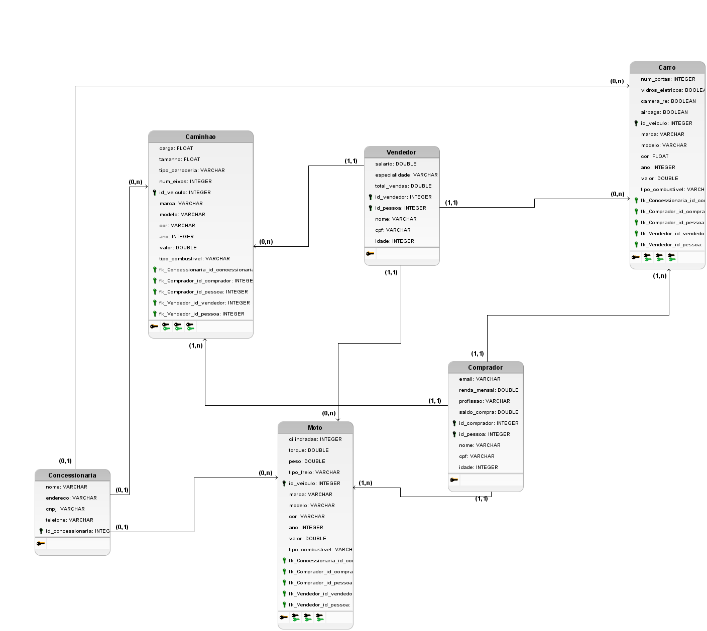

# Modelagem do Banco de Dados

Este módulo documenta a modelagem do banco de dados do projeto **Autocampos**.

## Modelo Conceitual

O modelo conceitual representa uma visão de alto nível, destacando as entidades principais e seus relacionamentos. Ele foi desenvolvido utilizando a notação Entidade-Relacionamento (ER) no BRModelo.


---

## Modelo Lógico

O modelo lógico traduz o modelo conceitual para uma estrutura mais próxima da implementação em banco de dados relacional, incluindo chaves primárias, estrangeiras e tipos de relacionamento.



---

## Modelo Físico

O modelo físico descreve a implementação real do banco de dados:

### Script SQL - AutoCampos

```sql

-- Remove tabelas existentes para evitar conflitos ao executar o script novamente.
-- A opção CASCADE remove automaticamente objetos dependentes (como views ou chaves estrangeiras).
DROP TABLE IF EXISTS interesses, vendas, anuncios, carros, motos, admins, funcionarios, usuarios, clientes CASCADE;

-- Tabela Central de Usuários do Sistema
-- Armazena dados de login e informações básicas para todos os usuários internos.
CREATE TABLE usuarios (
    id            SERIAL PRIMARY KEY,
    nome          TEXT NOT NULL,
    cpf           VARCHAR(11) NOT NULL UNIQUE,
    email         TEXT NOT NULL UNIQUE,
    senha         TEXT NOT NULL -- Em um ambiente real, a senha deve ser armazenada como um hash.
);

-- Tabela de Funcionários
-- Contém informações específicas de funcionários. Um funcionário é um tipo de usuário.
CREATE TABLE funcionarios (
    id                    SERIAL PRIMARY KEY,
    usuario_id            INTEGER NOT NULL UNIQUE REFERENCES usuarios(id) ON DELETE CASCADE,
    rendimento_mensal     NUMERIC(10, 2) NOT NULL
);

-- Tabela de Administradores
-- Designa quais usuários possuem privilégios de administrador. Um admin também é um tipo de usuário.
CREATE TABLE admins (
    id            SERIAL PRIMARY KEY,
    usuario_id    INTEGER NOT NULL UNIQUE REFERENCES usuarios(id) ON DELETE CASCADE,
    is_admin      BOOLEAN DEFAULT FALSE
);

-- Tabela de Clientes
-- Armazena informações de contato de clientes interessados ou que realizaram compras.
CREATE TABLE clientes (
    id            SERIAL PRIMARY KEY,
    nome          TEXT NOT NULL,
    cpf           VARCHAR(11) NOT NULL UNIQUE,
    email         TEXT UNIQUE,
    telefone      VARCHAR(20),
    endereco      TEXT
);

-- Tabela para Carros (agora inclui atributos de 'veiculos')
CREATE TABLE carros (
    id                    SERIAL PRIMARY KEY,
    modelo                TEXT NOT NULL,
    marca                 TEXT NOT NULL,
    ano                   INTEGER NOT NULL,
    cor                   TEXT,
    tipo_combustivel      VARCHAR(50),
    preco                 NUMERIC(10, 2) NOT NULL,
    revisado              BOOLEAN DEFAULT FALSE,
    disponivel            BOOLEAN DEFAULT TRUE,
    tipo_direcao          VARCHAR(50),
    tracao                VARCHAR(10),
    consumo_cidade        NUMERIC(4, 2),
    airbag                BOOLEAN DEFAULT FALSE,
    ar_condicionado       BOOLEAN DEFAULT FALSE
);

-- Tabela para Motos (agora inclui atributos de 'veiculos')
CREATE TABLE motos (
    id                    SERIAL PRIMARY KEY,
    modelo                TEXT NOT NULL,
    marca                 TEXT NOT NULL,
    ano                   INTEGER NOT NULL,
    cor                   TEXT,
    tipo_combustivel      VARCHAR(50),
    preco                 NUMERIC(10, 2) NOT NULL,
    revisado              BOOLEAN DEFAULT FALSE,
    disponivel            BOOLEAN DEFAULT TRUE,
    freio_dianteiro       VARCHAR(50),
    freio_traseiro        VARCHAR(50),
    estilo                VARCHAR(50),
    cilindradas           INTEGER,
    velocidade_max        INTEGER
);

-- Tabela de Anúncios
-- Um anúncio agora pode se referir a um carro OU uma moto, mas não a ambos.
CREATE TABLE anuncios (
    id                    SERIAL PRIMARY KEY,
    funcionario_id        INTEGER NOT NULL REFERENCES funcionarios(id),
    carro_id              INTEGER UNIQUE REFERENCES carros(id) ON DELETE CASCADE,
    moto_id               INTEGER UNIQUE REFERENCES motos(id) ON DELETE CASCADE,
    data_publicacao       DATE NOT NULL DEFAULT CURRENT_DATE,
    imagem1_url           TEXT,
    imagem2_url           TEXT,
    imagem3_url           TEXT,
    -- Restrição para garantir que apenas um dos IDs de veículo seja preenchido
    CONSTRAINT chk_carro_moto_anuncio CHECK ((carro_id IS NOT NULL AND moto_id IS NULL) OR (carro_id IS NULL AND moto_id IS NOT NULL))
);

-- Tabela de Vendas
-- Registra a venda de um veículo, que deve ser realizada por um funcionário.
-- Agora tem chaves estrangeiras diretas para carros e motos.
CREATE TABLE vendas (
    id                    SERIAL PRIMARY KEY,
    carro_id              INTEGER UNIQUE REFERENCES carros(id) ON DELETE RESTRICT,
    moto_id               INTEGER UNIQUE REFERENCES motos(id) ON DELETE RESTRICT,
    cliente_id            INTEGER NOT NULL REFERENCES clientes(id) ON DELETE RESTRICT,
    funcionario_id        INTEGER NOT NULL REFERENCES funcionarios(id) ON DELETE RESTRICT,
    data_venda            DATE NOT NULL DEFAULT CURRENT_DATE,
    valor_final           NUMERIC(10, 2) NOT NULL,
    comissao_venda        NUMERIC(10, 2),
    -- Restrição para garantir que apenas um dos IDs de veículo seja preenchido
    CONSTRAINT chk_carro_moto_venda CHECK ((carro_id IS NOT NULL AND moto_id IS NULL) OR (carro_id IS NULL AND moto_id IS NOT NULL))
);


-- Tabela de Interesses
-- Registra o interesse de um cliente em um veículo específico.
CREATE TABLE interesses (
    id                    SERIAL PRIMARY KEY,
    cliente_id            INTEGER NOT NULL REFERENCES clientes(id) ON DELETE CASCADE,
    carro_id              INTEGER REFERENCES carros(id) ON DELETE CASCADE,
    moto_id               INTEGER REFERENCES motos(id) ON DELETE CASCADE,
    data_visita           DATE,
    test_drive   BOOLEAN DEFAULT FALSE,
    -- Restrição para garantir que apenas um dos IDs de veículo seja preenchido
    CONSTRAINT chk_carro_moto_interesse CHECK ((carro_id IS NOT NULL AND moto_id IS NULL) OR (carro_id IS NULL AND moto_id IS NOT NULL)),
    -- Garante que um cliente não registre interesse duas vezes no mesmo carro ou moto
    UNIQUE (cliente_id, carro_id, moto_id)
);

```
