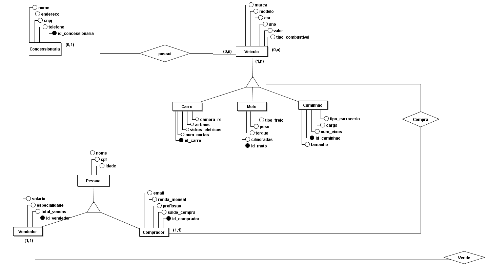

# Modelagem do Banco de Dados

Este módulo documenta a modelagem do banco de dados do projeto **Autocampos**.

## Modelo Conceitual

O modelo conceitual representa uma visão de alto nível, destacando as entidades principais e seus relacionamentos. Ele foi desenvolvido utilizando a notação Entidade-Relacionamento (ER) no BRModelo.



---

## Modelo Lógico

O modelo lógico traduz o modelo conceitual para uma estrutura mais próxima da implementação em banco de dados relacional, incluindo chaves primárias, estrangeiras e tipos de relacionamento.


---

## Modelo Físico

O modelo físico descreve a implementação real do banco de dados:

### Script SQL - AutoCampos

```sql

CREATE TABLE Concessionaria (
    id_concessionaria SERIAL PRIMARY KEY,
    nome VARCHAR(255),
    endereco VARCHAR(255),
    cnpj VARCHAR(20),
    telefone VARCHAR(20)
);

CREATE TABLE Vendedor (
    id_vendedor SERIAL,
    nome VARCHAR(255),
    cpf VARCHAR(14),
    idade INTEGER,
    salario DOUBLE PRECISION,
    especialidade VARCHAR(100),
    total_vendas DOUBLE PRECISION,
    PRIMARY KEY (id_vendedor)
);

CREATE TABLE Comprador (
    id_comprador SERIAL,
    nome VARCHAR(255),
    cpf VARCHAR(14),
    idade INTEGER,
    email VARCHAR(255),
    renda_mensal DOUBLE PRECISION,
    profissao VARCHAR(100),
    saldo_compra DOUBLE PRECISION,
    PRIMARY KEY (id_comprador)
);

CREATE TABLE Carro (
    id_carro SERIAL PRIMARY KEY,
    num_portas INTEGER,
    vidros_eletricos BOOLEAN,
    camera_re BOOLEAN,
    airbags BOOLEAN,
    marca VARCHAR(100),
    modelo VARCHAR(100),
    cor VARCHAR(50),
    ano INTEGER,
    valor DOUBLE PRECISION,
    tipo_combustivel VARCHAR(50),
    status_carro BOOLEAN,
    fk_Concessionaria_id_concessionaria INTEGER,
    fk_Comprador_id_comprador INTEGER NULL,
    fk_Vendedor_id_vendedor INTEGER NULL,
    CONSTRAINT fk_carro_concessionaria FOREIGN KEY (fk_Concessionaria_id_concessionaria)
        REFERENCES Concessionaria (id_concessionaria) ON DELETE SET NULL,
    CONSTRAINT fk_carro_comprador FOREIGN KEY (fk_Comprador_id_comprador)
        REFERENCES Comprador (id_comprador) ON DELETE RESTRICT,
    CONSTRAINT fk_carro_vendedor FOREIGN KEY (fk_Vendedor_id_vendedor)
        REFERENCES Vendedor (id_vendedor) ON DELETE CASCADE
);


CREATE TABLE Caminhao (
    id_caminhao SERIAL PRIMARY KEY,
    carga FLOAT,
    tamanho FLOAT,
    tipo_carroceria VARCHAR(100),
    num_eixos INTEGER,
    marca VARCHAR(100),
    modelo VARCHAR(100),
    cor VARCHAR(50),
    ano INTEGER,
    valor DOUBLE PRECISION,
    tipo_combustivel VARCHAR(50),
    status_caminhao BOOLEAN,
    fk_Concessionaria_id_concessionaria INTEGER,
    fk_Comprador_id_comprador INTEGER NULL,
    fk_Vendedor_id_vendedor INTEGER NULL,
    CONSTRAINT fk_caminhao_concessionaria FOREIGN KEY (fk_Concessionaria_id_concessionaria)
        REFERENCES Concessionaria (id_concessionaria) ON DELETE SET NULL,
    CONSTRAINT fk_caminhao_comprador FOREIGN KEY (fk_Comprador_id_comprador)
        REFERENCES Comprador (id_comprador) ON DELETE RESTRICT,
    CONSTRAINT fk_caminhao_vendedor FOREIGN KEY (fk_Vendedor_id_vendedor)
        REFERENCES Vendedor (id_vendedor) ON DELETE CASCADE
);

CREATE TABLE Moto (
    id_moto SERIAL PRIMARY KEY,
    cilindradas INTEGER,
    torque DOUBLE PRECISION,
    peso DOUBLE PRECISION,
    tipo_freio VARCHAR(50),
    marca VARCHAR(100),
    modelo VARCHAR(100),
    cor VARCHAR(50),
    ano INTEGER,
    valor DOUBLE PRECISION,
    tipo_combustivel VARCHAR(50),
    status_moto BOOLEAN,
    fk_Concessionaria_id_concessionaria INTEGER,
    fk_Comprador_id_comprador INTEGER NULL,
    fk_Vendedor_id_vendedor INTEGER NULL,
    CONSTRAINT fk_moto_concessionaria FOREIGN KEY (fk_Concessionaria_id_concessionaria)
        REFERENCES Concessionaria (id_concessionaria) ON DELETE SET NULL,
    CONSTRAINT fk_moto_comprador FOREIGN KEY (fk_Comprador_id_comprador)
        REFERENCES Comprador (id_comprador) ON DELETE RESTRICT,
    CONSTRAINT fk_moto_vendedor FOREIGN KEY (fk_Vendedor_id_vendedor)
        REFERENCES Vendedor (id_vendedor) ON DELETE CASCADE
);

```
