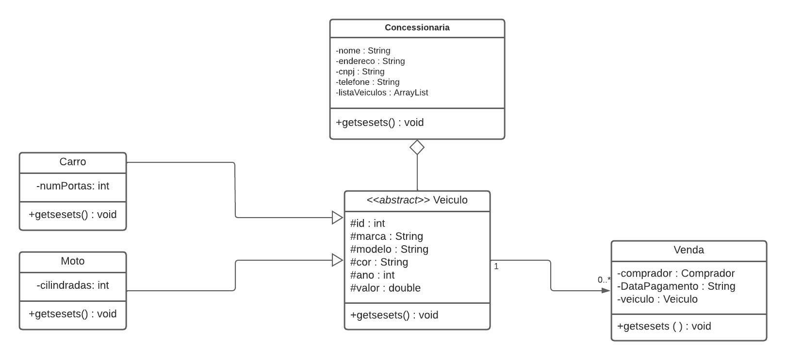

# UML - Diagrama de Classes

Esta seção apresenta os diagramas de classes utilizados no projeto **AutoCampos**, destacando a evolução do design ao longo do tempo.

## Objetivo

O diagrama de classes tem como objetivo representar a estrutura estática do sistema, detalhando as classes, seus atributos, métodos e os relacionamentos entre elas. Ele serve como base para o desenvolvimento e manutenção do código-fonte.

---

## Versão Antiga

A versão inicial do diagrama foi elaborada durante a disciplina de orientação a objetos, tendo em vista o amadurecimento durante o decorrer da graduação, se faz necessário a melhoria para melhor entendimento sobre o projeto.

**Principais características:**

- Estrutura simplificada
- Foco em entidades principais
- Relacionamentos básicos entre classes

---

## Versão Atualizada

A versão mais recente do diagrama reflete melhorias e refinamentos realizados após revisões técnicas.

**Melhorias implementadas:**

- Inclusão de novas classes e responsabilidades

---
